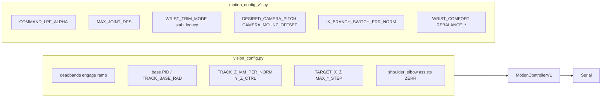

# Tune V1 motion for smooth face tracking

This document is the in-repo checklist for **on-robot** tuning. The motion stack splits into:

- **`glados_arm/vision_config.py`** — image error → persistent targets (base yaw, `target_x_mm` / `target_z_mm`), PID, deadbands, assists, workspace envelope.
- **`glados_arm/motion_config_v1.py`** — output shaping (LPF, max deg/s), IK branch hysteresis, wrist stabilization, posture rebalance.

**Rule of thumb:** Fix jitter and overshoot in **vision_config** first. Use **motion_config_v1** to cap how fast joint commands change and to tune wrist “chicken head” — not to fix wrong signs or unstable PID.



---

## Phase 0 — Safety and baseline

1. Use an appropriate servo power supply (not USB-only for loaded joints).
2. **Camera + detection only (no servos):**
   ```bash
   python -m glados_arm.face_tracking --preview --no-serial
   ```
   Confirm stable bbox, FPS, overlay. If the box jitters, tune **Haar** first: `HAAR_MIN_NEIGHBORS`, `HAAR_SCALE_FACTOR`, `FACE_CENTER_ALPHA` in `vision_config.py`.
3. **Serial + IK mode** (default `CONTROL_MODE = "ik"`):
   ```bash
   python -m glados_arm.face_tracking --preview --port /dev/ttyACM0
   ```
   Stand clear; verify correction direction (left/right, up/down) with `SIGN_ERROR_X_BASE` and vertical signs in `vision_config.py` if needed.
4. **Optional:** compare with proportional mode:
   ```bash
   python -m glados_arm.face_tracking --control-mode proportional
   ```

---

## Phase 1 — Smooth horizontal (base)

**Symptoms:** base hunts, overshoots center, or feels sluggish.

| Knob | Location |
|------|------------|
| `BASE_X_CTRL_MODE` (`"pid"` vs `"p"`), `BASE_PID_*`, `MAX_BASE_YAW_STEP_RAD` | `vision_config.py` |
| `TRACK_DEADBAND` | `vision_config.py` |
| `LOCK_IN_FRAMES`, `ENGAGE_UP_PER_FRAME`, `ENGAGE_DOWN_PER_FRAME` | `vision_config.py` |
| `MAX_JOINT_DPS` — tuple order is **wrist, elbow, base, shoulder** | `motion_config_v1.py` |

Lower the **base** component of `MAX_JOINT_DPS` if the base still twitches after PID is stable.

---

## Phase 2 — Smooth vertical (IK targets + assists)

**Symptoms:** vertical oscillation, “zoomy” Z, elbow snapping, shoulder never participates.

| Knob | Notes |
|------|--------|
| `Y_Z_CTRL_MODE = "p"` with `TRACK_Z_MM_PER_NORM` | Recommended; use `"pid"` only if you accept extra tuning (`Y_PID_*`). |
| `MAX_Z_STEP_MM`, `MAX_X_STEP_MM` | Limit per-frame target motion. |
| `TARGET_*_MM` | Workspace envelope; avoid slamming IK limits. |
| `TRACK_SHOULDER_ASSIST_*`, `TRACK_ELBOW_ASSIST_*`, `ZERR_SHOULDER_*` | `vision_config.py` — use sparingly; high values fight smoothing. |
| `IK_BRANCH_SWITCH_ERR_NORM` | `motion_config_v1.py` — if elbow solution flips when the face bobs, **raise** slightly (e.g. 0.15–0.2). |

---

## Phase 3 — Output smoothing (joint slew + LPF)

**Symptoms:** motion looks filtered but laggy, or still jerky after Phases 1–2.

| Knob | Notes |
|------|--------|
| `COMMAND_LPF_ALPHA` | Higher = smoother, more lag. Typical range ~0.2–0.5. |
| `MAX_JOINT_DPS` | Deg/s per joint after LPF. Reduce wrist/elbow first if the tip snaps. |
| `MAX_JOINT_ACCEL_DPS2` | Default all zeros (accel off). Enable small values only if you still need jerk reduction after velocity limits are set. |

---

## Phase 4 — Wrist stabilization (“chicken head”)

**Symptoms:** camera bobs when shoulder/elbow move; wrist fights IK.

1. **`WRIST_TRIM_MODE`:** `"stab"` (default) vs `"legacy"` (image-based trim only, for A/B).
2. **`DESIRED_CAMERA_PITCH_RAD`**, **`CAMERA_MOUNT_OFFSET_RAD`** — small iterative changes while watching a fixed horizon in frame.
3. **`BASE_YAW_COUPLING_GAIN`** — optional, if panning couples into apparent pitch.
4. **`WRIST_COMFORT_HALF_SPAN_DEG`**, **`REBALANCE_TARGET_Z_MM`**, **`REBALANCE_MAX_ITER`** — if wrist saturates often, widen comfort or increase rebalance step slightly.

All in `motion_config_v1.py`.

---

## Phase 5 — Distance hold (optional)

Only if you need **range** from face width:

- Set `DIST_CONTROL_ENABLE = True` in `vision_config.py`.
- Tune **slowly**: `DIST_MM_PER_PX`, `DIST_MAX_STEP_MM`, `DIST_DEADBAND_PX`. Aggressive distance gains fight smooth tracking.

---

## Validation

| Check | Pass criteria |
|------|----------------|
| No face | Holds last pose; after timeout, behavior per `NO_FACE_*` in `vision_config.py`. |
| Face re-acquire | No violent snap (tune `LOCK_IN_FRAMES`, `FIRST_FIND_*` if enabled). |
| Center | Face error trends toward zero without sustained oscillation at limits. |
| Regression tests | From repo root: `python -m unittest discover -s tests -p "test_*.py"` |

---

## Document your robot

Keep a **copy** of the tuned `vision_config.py` and `motion_config_v1.py` (or a short note with non-default values) in your lab notebook or a private gist so you can restore after pulls.

---

## Rollback

Compare behavior to git tag **`backup/motion-pre-v1`** or branch **`backup/pre-motion-v1-20260407`** if you need the pre–V1 motion stack.
